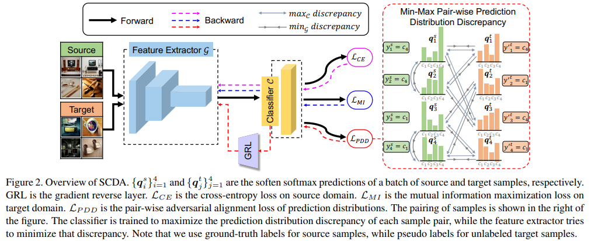

# Semantic Concentration for Domain Adaptation

Code release for "Semantic Concentration for Domain Adaptation" (ICCV 2021)

## Paper

<div align=center></div>

[Semantic Concentration for Domain Adaptation](https://arxiv.org/abs/2108.05720) 
(ICCV 2021)

We propose Semantic Concentration for Domain Adaptation (SCDA), which encourages the model to concentrate on the most principal features via the pair-wise adversarial alignment of prediction distributions

## Requirements

The model is trained on a NVIDIA RTX 2080Ti GPU.

* `python 3.7`
* `torch >= 1.7.0`
* `torchvision >= 0.8.1`
* `PIL >= 7.2.0`
* `numpy`
* `argparse`

## Datasets

### Office-31
Office-31 dataset can be found [here](https://people.eecs.berkeley.edu/~jhoffman/domainadapt/).

### Office-Home
Office-Home dataset can be found [here](http://hemanthdv.org/OfficeHome-Dataset/).

### DomainNet
DomainNet dataset can be found [here](http://ai.bu.edu/M3SDA/).

## Running the code

Train on DomainNet with ResNet-101
```
python3 train_SCDA.py --gpu_id 2 --arch resnet101 --dset domainnet --output_dir log/SCDA/domainnet --s_dset_path data/list/DomainNet/clipart_train.txt --t_dset_path data/list/DomainNet/infograph_train.txt --t_test_path data/list/DomainNet/infograph_test.txt --epochs 30 --iters-per-epoch 1000 --pdd_tradeoff 1.0 --MI_tradeoff 0.1 --temp 10.0 --threshold 0.8 --lr 0.01
```

Train on Office-Home with ResNet-50
```
python3 train_SCDA.py --gpu_id 2 --arch resnet50 --dset office-home --output_dir log/SCDA/home --s_dset_path data/list/OfficeHome/Art_65.txt --t_dset_path data/list/OfficeHome/Clipart_65.txt --epochs 40 --iters-per-epoch 500 --pdd_tradeoff 1.0 --MI_tradeoff 0.1 --temp 10.0 --threshold 0.8 --lr 0.01
```

Train on Office-31 with ResNet-50
```
python3 train_SCDA.py --gpu_id 2 --arch resnet50 --dset office --output_dir log/SCDA/office31 --s_dset_path data/list/office31/amazon_31.txt --t_dset_path data/list/office31/webcam_31.txt --epochs 40 --iters-per-epoch 500 --pdd_tradeoff 1.0 --MI_tradeoff 0.1 --temp 10.0 --threshold 0.8 --lr 0.01
```

## Evaluate

Pre-trained models can be downloaded [here](https://github.com/BIT-DA/SCDA/releases) and put in <root_dir>/Checkpoint

evaluate on DomainNet
```
python3 evaluate.py --gpu_id 2 --arch resnet50 --dset office --t_test_path data/list/office31/webcam_31.txt --weight_path Checkpoint/amazon-webcam.pth.tar
```


## Citation
If you find this code useful for your research, please cite our [paper](https://arxiv.org/abs/2108.05720):
```
@inproceedings{Li2021SCDA,
    title = {Semantic Concentration for Domain Adaptation},
    author = {Li, Shuang and Xie, Mixue and Lv, Fangrui and Liu, Chi Harold and Liang, Jian and Qin, Chen and Li, Wei},
    booktitle = {ICCV},   
    year = {2021}
}
```

## Acknowledgements
Some codes are adapted from [Transfer-Learning-Library](https://github.com/thuml/Transfer-Learning-Library). We thank them for their excellent projects.

## Contact
If you have any problem about our code, feel free to contact
- shuangli@bit.edu.cn
- michellexie102@gmail.com
- fangruilv@bit.edu.cn

or describe your problem in Issues.


